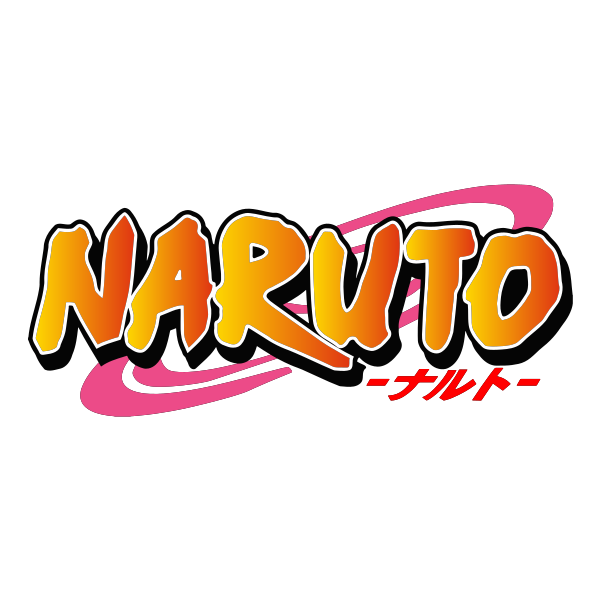

<div align="center">
	
	<br/>
	<a href="https://naruto-jogo-da-memoria.netlify.app">
		
	</a>
</div>

## Memória Coder — Naruto (React + Vite)

Jogo da memória construído com React 19 e Vite, tema Naruto, animação 3D nas cartas e arquitetura modular.

### Live Demo

https://naruto-jogo-da-memoria.netlify.app

## Como rodar o projeto

Pré-requisitos: Node 18+ e npm.

Desenvolvimento (hot reload):

```powershell
cd "d:\leo\Projetos\🎮 Jogo da Memória"
npm install
npm run dev -- --host
```

Build de produção e preview local:

```powershell
npm run clean
npm run build
npm run preview
```

Testes (Vitest):

```powershell
npm test            # executa a suíte uma vez (CI)
npm run test:watch  # modo observação durante o desenvolvimento
```

## Features principais

- Geração e embaralhamento de cartas (utils dedicados)
- Mecânica de jogo: vira 2 cartas, confere par, desvira após 1s se não combinar
- Hook `useMemoryGame` centraliza a regra (estado previsível e fácil de testar)
- Bloqueio consistente: impede virar a 3ª carta durante mismatch; libera imediatamente no match
- Vitória e cronômetro param no momento em que o último par é encontrado
- HUD com contador de jogadas e cronômetro que inicia no primeiro clique
- Reinício do jogo (reset total de estados)
- Animação 3D de flip com CSS (transform/transition)
- Layout responsivo (grid 4 colunas desktop, 3 em telas menores)
- Tema Naruto com cor de fundo “laranja Naruto” no verso das cartas e watermark de Kunai em SVG; ícones de personagens em SVG

## Tecnologias utilizadas

- React 19 (Hooks)
- Vite 7 (build/dev server)
- JavaScript moderno (ES6+)
- CSS moderno (Flex/Grid, transitions, transform 3D)
- Vitest + Testing Library + jsdom (testes unitários)
- ESLint
- Husky + Commitlint (Conventional Commits)
- Netlify (deploy)

## Estrutura do projeto

```
src/
	components/        # UI: Header, ScorePanel, GameBoard, Card
	hooks/             # useMemoryGame (núcleo de regras do jogo)
	utils/             # Lógica pura: shuffle, generateCards
	assets/naruto/     # Ícones SVG do tema + Banner do README
	test/              # setup de testes (jest-dom)
public/
	leaf.svg           # Favicon
vitest.config.js     # configuração de testes
netlify.toml         # config de deploy/headers (se aplicável)
```

## Observações

- Os ícones de Naruto são placeholders em SVG; substitua por artes oficiais se tiver licença. Basta trocar os arquivos em `src/assets/naruto/`.
- As regras do jogo estão isoladas em `src/hooks/useMemoryGame.js`, facilitando evolução e testes.


## Deploy

- Netlify: Build command `npm run build`, Publish directory `dist` (SPA, com headers no `netlify.toml`).

